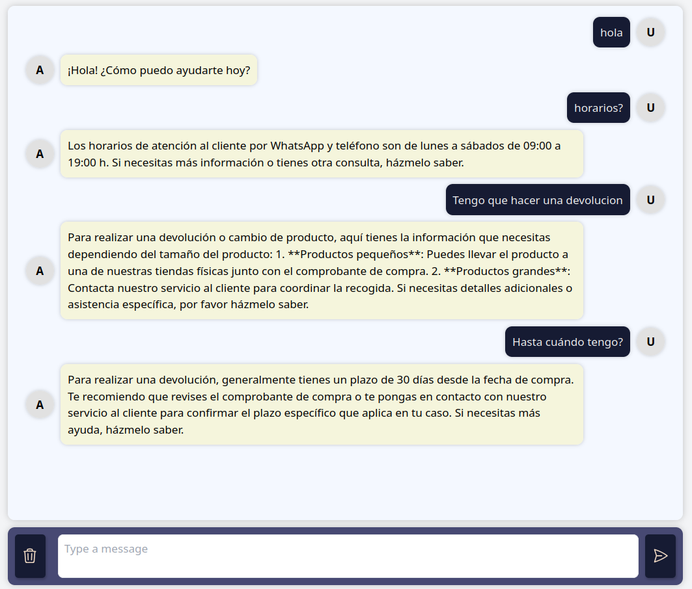
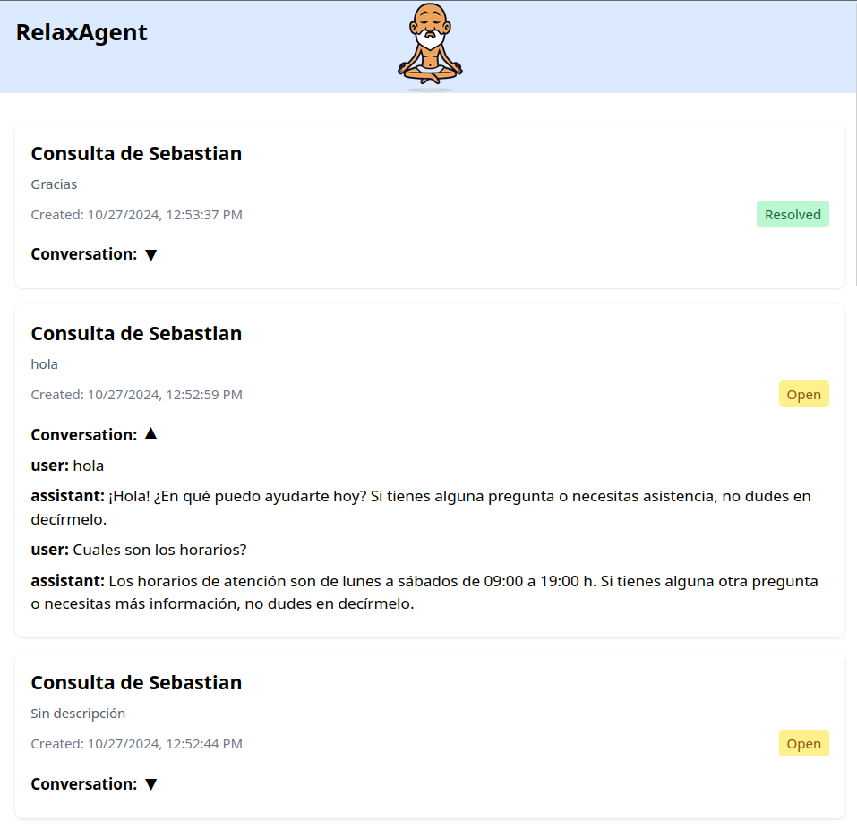
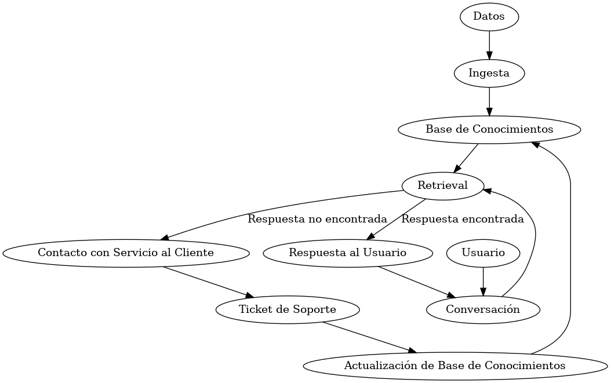

# Aplicación de Soporte al Cliente con IA

Esta es una aplicación de soporte al cliente con agentes de IA y RAG. Utiliza un backend en Python con FastAPI y un frontend en Vue.js para proporcionar una interfaz de chat interactiva que puede responder a las consultas de los clientes.

## Características
- Crea una knowledge base de preguntas frecuentes (FAQs) a partir de un URL
- Chat en tiempo real con IA 
- RAG con n-FAQs mejores coincidencias mediante OpenAIEmbeddings y ChromaDB
- Dashboard de tickets de soporte
- Interfaz de usuario intuitiva (Vue.js)
- Con soporte de IAgents (Swarm) para db y redireccionamiento de customer service
- Backend robusto con FastAPI y enfoque escalable/modular
- Almacenamiento de mensajes en MongoDB
- Creación de tickets de soporte automáticos y derivación a agentes humanos




## Requisitos

- Docker y Docker Compose (recomendado), Node.js 14+
- Alternativamente: Python 3.11+, Node.js 14+, MongoDB

## Configuración y Ejecución

### Backend usando Docker Compose (Recomendado)

1. Clona este repositorio:
   ```
   git clone <url-del-repositorio>
   cd <nombre-del-directorio>
   ```

2. Crea un archivo `.env` en la raíz del proyecto y añade tu clave API de OpenAI:
   ``` OPENAI_API_KEY=tu_clave_api_aqui ```

3. Ejecuta el backend con Docker Compose:
   ``` docker compose up --build ```

4. Accede a la aplicación en `http://localhost:8000`

### Opción 2: Backend Manual

1. Instala las dependencias de Python:
   ``` pip install -r requirements.txt ```

2. Instala y ejecuta MongoDB

3. Crea un archivo `.env` en la raíz del proyecto y añade tu clave API de OpenAI:
   ``` OPENAI_API_KEY=tu_clave_api_aqui; MONGO_URI=mongodb://localhost:27017 ```

4. Ejecuta el servidor FastAPI:
   ```python main.py```

### Frontend

1. Navega al directorio de la aplicación:
   ```cd app```

2. Instala las dependencias de Node.js:
   ```npm install```

3. Ejecuta el servidor de desarrollo:
   ```npm run dev```

4. Accede a la aplicación en la URL proporcionada por Vite (generalmente `http://localhost:5173`)

## Uso

Una vez que la aplicación esté en funcionamiento, puedes interactuar con el chatbot de IA a través de la interfaz web. Escribe tus preguntas o comentarios en el campo de entrada y recibirás respuestas generadas por la IA.

## Contribuciones

Las contribuciones son bienvenidas. Por favor, abre un issue para discutir cambios mayores antes de crear un pull request.

## Licencia

Este proyecto está bajo la Licencia MIT. Consulta el archivo `LICENSE` para más detalles.

## Diagrama de Flujo del Pipeline



## Componentes del Pipeline

1. **Datos**: Información inicial, FAQs, y conocimiento del dominio.

2. **Ingesta**: Proceso de carga y procesamiento de datos en el sistema.

3. **Base de Conocimientos**: Almacenamiento vectorial de la información procesada.

4. **Conversación**: Interfaz de interacción entre el usuario y el asistente virtual.

5. **Retrieval**: Búsqueda de información relevante en la base de conocimientos.

6. **Respuesta al Usuario**: Generación y entrega de respuestas basadas en la información recuperada.

7. **Contacto con Servicio al Cliente**: Derivación a agentes humanos cuando sea necesario.

8. **Ticket de Soporte**: Creación y seguimiento de casos no resueltos automáticamente.

9. **Actualización de Base de Conocimientos**: Mejora continua del sistema con nueva información.

## Flujo de Trabajo

1. Los datos se ingresan al sistema a través del proceso de ingesta.
2. La información procesada se almacena en la base de conocimientos vectorial.
3. El usuario inicia una conversación con el asistente virtual.
4. El sistema realiza una búsqueda (retrieval) en la base de conocimientos.
5. Si se encuentra una respuesta adecuada, se proporciona al usuario.
6. Si no se encuentra una respuesta, se deriva al servicio de atención al cliente.
7. Se crea un ticket de soporte para las consultas no resueltas automáticamente.
8. La base de conocimientos se actualiza con nueva información de los tickets resueltos.

Este pipeline permite una atención al cliente eficiente y una mejora continua del sistema de asistencia virtual.
